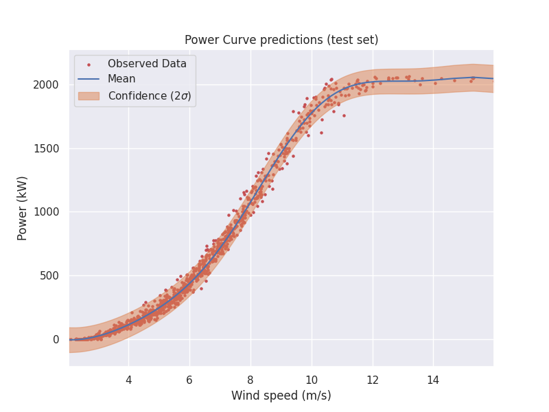

# REStats 🌳

  

`REStats` is a Python package that provides tools and models for analyzing and predicting the
performance of hybrid wind/hydrogen systems. It couples wind speed forecasts with power curve
prediction, offering a modular framework for robust analysis and decision-making under uncertainty.

## Features

- Wind speed Weibull distribution fitting
- Wind speed data preprocessing utilities
- ARMA wind speed and wind direction forecast modeling
- Power curve outlier filtering utilities
- Gaussian Process Regression power curve prediction
- Simulations for wind power forecasting applied to Proton Exchange Membrane (PEM) hydrogen electrolyzer production
- Plotting and visualization utilities

## Installation

`pip install git+https://github.com/camirmas/REStats`

## Documentation

Examples may be found in the `notebooks` directory. Documentation is hosted via Read the Docs:

https://restats.readthedocs.io/en/latest/

## Data

The data for the examples comes from the Kelmarsh Wind Farm in the UK:

https://zenodo.org/record/7212475
